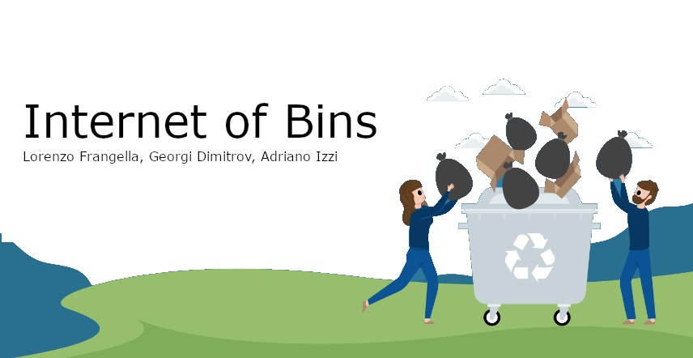

# Internet-of-Bins

  

## Group Members

- **Georgi Todorov Dimitrov** - [LinkedIn](https://www.linkedin.com/in/georgi-dimitrov-66859621b)
- **Adriano Izzi** - [LinkedIn](https://www.linkedin.com/in/adriano-izzi-b67848303?utm_source=share&utm_campaign=share_via&utm_content=profile&utm_medium=android_app)
- **Lorenzo Frangella** - [LinkedIn](https://www.linkedin.com/in/lorenzo-frangella-3492b123b)

---

## Project Description

The problem of efficiently managing garbage collection in a city cannot be properly addressed without accurate information about the environment. The main idea behind the **Internet-of-Bins** project is to create a network of interconnected devices that collect data about the current state of public garbage bins. This data is then used to optimize garbage collection schedules, ensuring bins are emptied in a timely manner without unnecessary trips.

### Key Features:

- **Real-time monitoring** of bin fill levels, temperature, and gas emissions.
- **Smart notifications** to alert when bins are full or emit foul smells.
- **Fire detection** through temperature monitoring.
- **Adaptive learning** to predict fill rates and optimize collection schedules.

---

## How It Works

1. **IoT Nodes**: Each bin is equipped with a node that includes sensors to measure fill levels, temperature, and gas emissions.
2. **Communication**: Nodes communicate with each other using LoRa antennas, forming a mesh network. At least one node in the system has a Wi-Fi antenna to connect to the cloud.
3. **Data Collection**: Data such as fill level, temperature, and gas levels are collected and sent to the cloud for analysis.
4. **Notifications**: Alerts are sent when bins are full, emit foul smells, or are at risk of fire.
5. **Optimization**: The system learns the fill rates of each bin and adjusts collection schedules accordingly.

---

## External Services Used

- **Cloud Storage**: AWS for storing collected data.
- **MQTT Broker**: For sending notifications and receiving configuration updates.

---

## Constraints

- **Energy**: Batteries must last for years.
- **Distance**: Nodes must communicate over hundreds of meters.
- **Load Balancing**: Some nodes may have more workload than others.
- **Bandwidth**: Limit message size and reduce cloud operations.
- **Clock Drift**: Synchronization is required for effective communication.

---

## Evaluation Metrics

- **Energy Consumption**: Monitored using an INA219 sensor.
- **Bandwidth Usage**: Measured by the quantity of data sent through the cloud.
- **Packet Delivery**: Ratio of delivered messages between peers.
- **Number of Failures**: Count of bins becoming completely full or emitting foul smells.

---

## Presentation

[Project Presentation Link](https://docs.google.com/file/d/1pONCwGM1phE4SlMqMEI0D48bGyRs6bVL/edit?usp=docslist_api&filetype=mspresentation)

---

## Prototype and Results

### Prototype and Circuit Images:
You can find the images of the **prototype** and **electronic circuit** in the **Image Directory**. These images showcase the physical implementation of the IoT-enabled garbage bin, including the sensors, communication modules, and overall design.

### Energy Consumption Plots:
The **Plots Directory** contains images of the **energy consumption measurements**. These plots demonstrate the system's efficiency and low power usage, which are critical for ensuring long battery life in the IoT nodes.

## Future Work

- **Integration with city waste management systems**.
- **Expansion to other public utilities** (e.g., recycling bins, compost bins).
- **Enhanced machine learning algorithms** for better prediction of fill rates.
