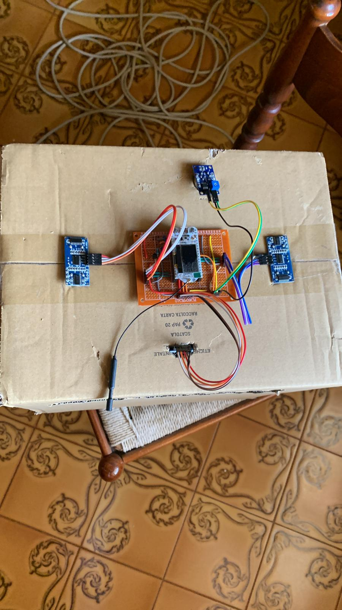

The actual project is inside the /app folder

# Setup

The system setup is done by connecting at least two esp32-s2 to Pcs.
The idf target must be set to "esp32".

To make the system working, each of the esp must have a RTC clock and a LoRa antenna.

At this point, go into the /protocol/main_protocol.h and set the variable "wifi" to 1.

Build and flash one of the nodes, that will be the gateway.

Use the bluetooth app to send the security key, and the gateway setup is done.

Set the "wifi" variable to 0 and build and flash the other node. That will be a standard node.

Repeat the bluetooth pattern, and the system will be correctly configurated.

# Circuit

A fully build circuit consist of a central ESP32 connected to:

- RTC clock with temperature sensor
- two ultrasound sensors
- one MQ135 sensor
- LoRa antenna

# Other Informations

See the power point presentation "Presentazione Finale Internet of Bins"